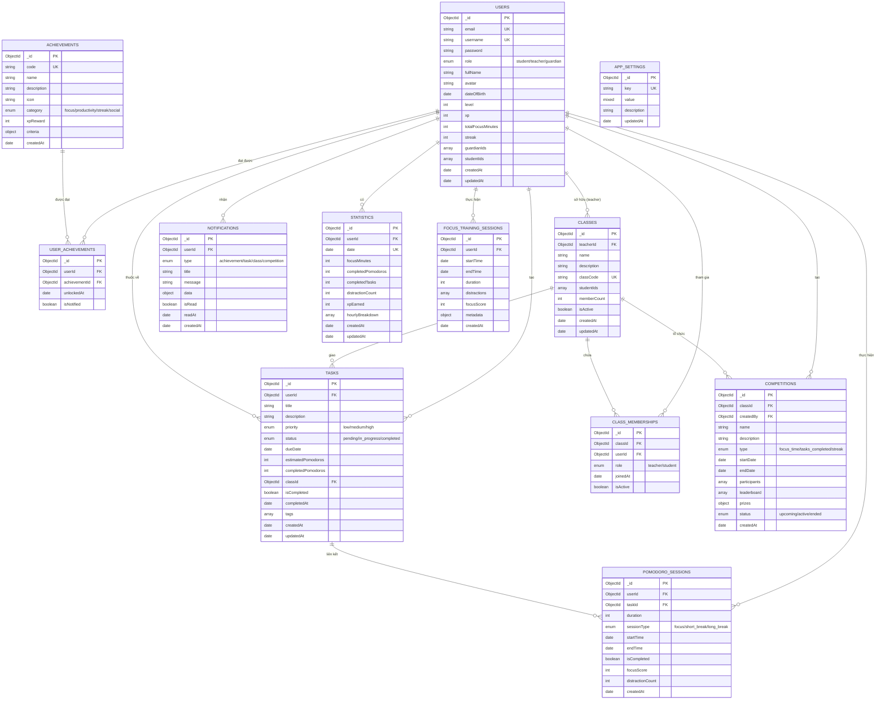
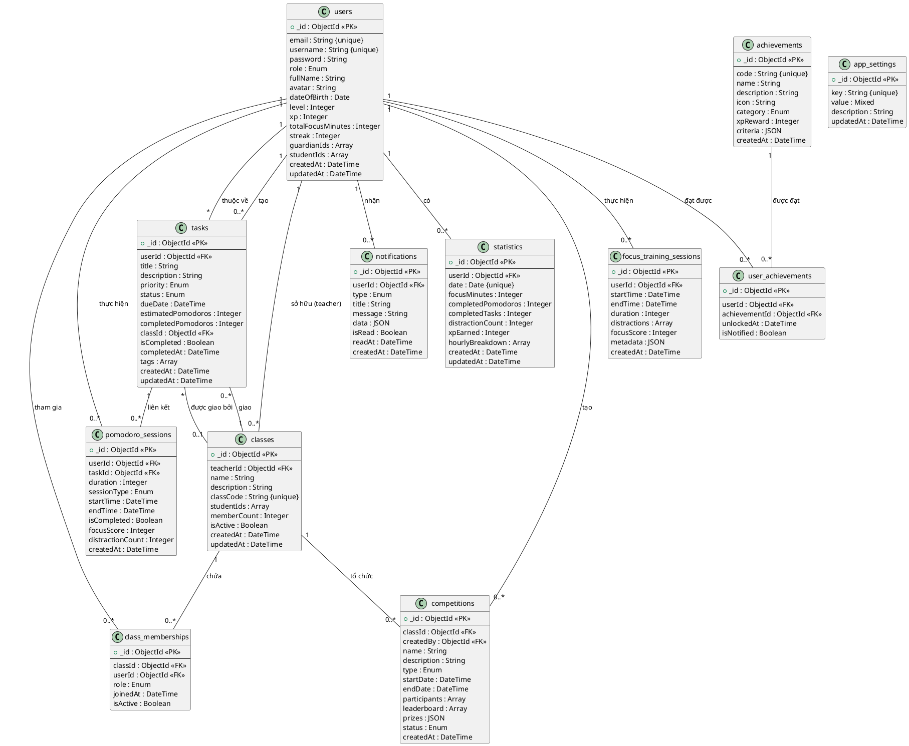

# Sơ đồ ERD - DeepFocus Database Schema

## Cách sử dụng:

### 1. Sử dụng Mermaid Live Editor

- Truy cập: https://mermaid.live/
- Copy toàn bộ code Mermaid bên dưới
- Paste vào editor
- Export thành PNG/SVG

### 2. Sử dụng trong VS Code

- Cài extension: "Markdown Preview Mermaid Support" hoặc "Mermaid Markdown Syntax Highlighting"
- Preview file này
- Click chuột phải > Export to PNG/SVG

### 3. Sử dụng dbdiagram.io (Khuyến nghị cho ERD phức tạp)

- Truy cập: https://dbdiagram.io/
- Copy code DBML ở phần 2 bên dưới
- Paste vào editor
- Export diagram

---

## PHẦN 1: MERMAID ERD DIAGRAM



---

## PHẦN 2: DBML CODE (Cho dbdiagram.io)

Sử dụng code này tại https://dbdiagram.io/ để có diagram đẹp hơn và nhiều tùy chỉnh hơn:

```dbml
// DeepFocus Database Schema
// Created: 2024
// Database: MongoDB

Table users {
  _id ObjectId [pk]
  email String [unique, not null]
  username String [unique, not null]
  password String [not null]
  role Enum [note: 'student, teacher, guardian']
  fullName String
  avatar String
  dateOfBirth Date
  level Integer [default: 1]
  xp Integer [default: 0]
  totalFocusMinutes Integer [default: 0]
  streak Integer [default: 0]
  guardianIds Array
  studentIds Array
  createdAt DateTime
  updatedAt DateTime

  Indexes {
    email [unique]
    username [unique]
    role
  }
}

Table tasks {
  _id ObjectId [pk]
  userId ObjectId [ref: > users._id, not null]
  title String [not null]
  description String
  priority Enum [note: 'low, medium, high']
  status Enum [note: 'pending, in_progress, completed']
  dueDate DateTime
  estimatedPomodoros Integer
  completedPomodoros Integer [default: 0]
  classId ObjectId [ref: > classes._id]
  isCompleted Boolean [default: false]
  completedAt DateTime
  tags Array
  createdAt DateTime
  updatedAt DateTime

  Indexes {
    userId
    classId
    status
    dueDate
  }
}

Table pomodoro_sessions {
  _id ObjectId [pk]
  userId ObjectId [ref: > users._id, not null]
  taskId ObjectId [ref: > tasks._id]
  duration Integer [note: 'phút']
  sessionType Enum [note: 'focus, short_break, long_break']
  startTime DateTime
  endTime DateTime
  isCompleted Boolean
  focusScore Integer
  distractionCount Integer
  createdAt DateTime

  Indexes {
    userId
    taskId
    startTime
  }
}

Table achievements {
  _id ObjectId [pk]
  code String [unique, not null]
  name String [not null]
  description String
  icon String
  category Enum [note: 'focus, productivity, streak, social']
  xpReward Integer
  criteria JSON
  createdAt DateTime

  Indexes {
    code [unique]
    category
  }
}

Table user_achievements {
  _id ObjectId [pk]
  userId ObjectId [ref: > users._id, not null]
  achievementId ObjectId [ref: > achievements._id, not null]
  unlockedAt DateTime
  isNotified Boolean [default: false]

  Indexes {
    (userId, achievementId) [unique]
    userId
  }
}

Table classes {
  _id ObjectId [pk]
  teacherId ObjectId [ref: > users._id, not null]
  name String [not null]
  description String
  classCode String [unique, not null]
  studentIds Array
  memberCount Integer [default: 0]
  isActive Boolean [default: true]
  createdAt DateTime
  updatedAt DateTime

  Indexes {
    classCode [unique]
    teacherId
  }
}

Table class_memberships {
  _id ObjectId [pk]
  classId ObjectId [ref: > classes._id, not null]
  userId ObjectId [ref: > users._id, not null]
  role Enum [note: 'teacher, student']
  joinedAt DateTime
  isActive Boolean [default: true]

  Indexes {
    (classId, userId) [unique]
    classId
    userId
  }
}

Table notifications {
  _id ObjectId [pk]
  userId ObjectId [ref: > users._id, not null]
  type Enum [note: 'achievement, task, class, competition']
  title String [not null]
  message String
  data JSON
  isRead Boolean [default: false]
  readAt DateTime
  createdAt DateTime

  Indexes {
    userId
    isRead
    createdAt
  }
}

Table statistics {
  _id ObjectId [pk]
  userId ObjectId [ref: > users._id, not null]
  date Date [not null]
  focusMinutes Integer [default: 0]
  completedPomodoros Integer [default: 0]
  completedTasks Integer [default: 0]
  distractionCount Integer [default: 0]
  xpEarned Integer [default: 0]
  hourlyBreakdown Array
  createdAt DateTime
  updatedAt DateTime

  Indexes {
    (userId, date) [unique]
    userId
    date
  }
}

Table competitions {
  _id ObjectId [pk]
  classId ObjectId [ref: > classes._id, not null]
  createdBy ObjectId [ref: > users._id, not null]
  name String [not null]
  description String
  type Enum [note: 'focus_time, tasks_completed, streak']
  startDate DateTime
  endDate DateTime
  participants Array
  leaderboard Array
  prizes JSON
  status Enum [note: 'upcoming, active, ended']
  createdAt DateTime

  Indexes {
    classId
    status
    startDate
  }
}

Table focus_training_sessions {
  _id ObjectId [pk]
  userId ObjectId [ref: > users._id, not null]
  startTime DateTime
  endTime DateTime
  duration Integer
  distractions Array
  focusScore Integer
  metadata JSON
  createdAt DateTime

  Indexes {
    userId
    startTime
  }
}

Table app_settings {
  _id ObjectId [pk]
  key String [unique, not null]
  value Mixed
  description String
  updatedAt DateTime

  Indexes {
    key [unique]
  }
}
```

---

## PHẦN 3: PlantUML CODE (Cho Enterprise Architect, StarUML)



---

## PHẦN 4: Lệnh Command Line để tạo ERD

### Sử dụng Mermaid CLI:

```bash
# 1. Cài đặt Mermaid CLI
npm install -g @mermaid-js/mermaid-cli

# 2. Tạo file mermaid
# Copy code Mermaid ở Phần 1 vào file: deepfocus-erd.mmd

# 3. Generate PNG
mmdc -i deepfocus-erd.mmd -o deepfocus-erd.png -w 2400 -H 1800

# 4. Generate SVG (vector, zoom không mất chất lượng)
mmdc -i deepfocus-erd.mmd -o deepfocus-erd.svg -w 2400 -H 1800

# 5. Generate PDF
mmdc -i deepfocus-erd.mmd -o deepfocus-erd.pdf -w 2400 -H 1800
```

### Sử dụng PlantUML:

```bash
# 1. Cài đặt PlantUML
# Download từ: https://plantuml.com/download
# Hoặc sử dụng Docker:
docker pull plantuml/plantuml

# 2. Tạo file plantuml
# Copy code PlantUML ở Phần 3 vào file: deepfocus-erd.puml

# 3. Generate PNG
java -jar plantuml.jar deepfocus-erd.puml

# 4. Generate SVG
java -jar plantuml.jar -tsvg deepfocus-erd.puml

# 5. Sử dụng Docker
docker run --rm -v $(pwd):/data plantuml/plantuml deepfocus-erd.puml
```

---

## PHẦN 5: Công cụ Online (Không cần cài đặt)

### 1. Mermaid Live Editor (Khuyến nghị cho Mermaid)

- URL: https://mermaid.live/
- Copy code Mermaid → Paste → Export PNG/SVG/PDF

### 2. dbdiagram.io (Khuyến nghị cho ERD phức tạp)

- URL: https://dbdiagram.io/
- Copy code DBML → Paste → Export PNG/PDF
- Features: Zoom, pan, customize colors, note annotations

### 3. PlantUML Online Server

- URL: http://www.plantuml.com/plantuml/uml/
- Paste code PlantUML → Generate → Download

### 4. Draw.io / diagrams.net

- URL: https://app.diagrams.net/
- Import → Mermaid/PlantUML → Edit → Export

### 5. QuickDBD

- URL: https://www.quickdatabasediagrams.com/
- Simple DSL syntax → Generate ERD

---

## PHẦN 6: VS Code Extensions (Trong editor)

```bash
# Cài đặt extensions trong VS Code:
code --install-extension bierner.markdown-mermaid
code --install-extension jebbs.plantuml
code --install-extension hediet.vscode-drawio

# Sau đó preview file này trong VS Code để xem ERD
```

---

## Ghi chú:

- **Mermaid**: Tốt nhất cho Markdown, GitHub, GitLab
- **DBML (dbdiagram.io)**: Tốt nhất cho ERD phức tạp, đẹp, chuyên nghiệp
- **PlantUML**: Tốt cho tài liệu kỹ thuật, tích hợp IDE
- **Draw.io**: Tốt cho tùy chỉnh thủ công, nhiều loại diagram

Khuyến nghị: **Sử dụng dbdiagram.io** để có ERD đẹp nhất cho báo cáo! 🎨
