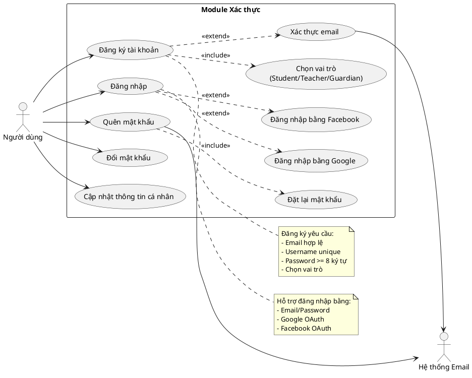
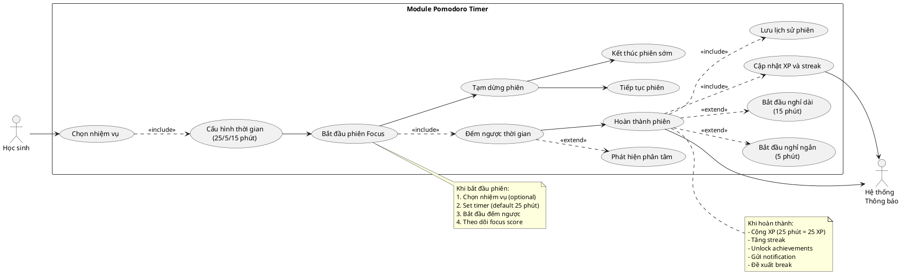
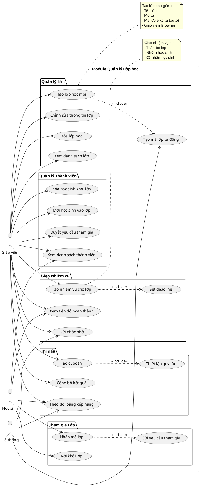
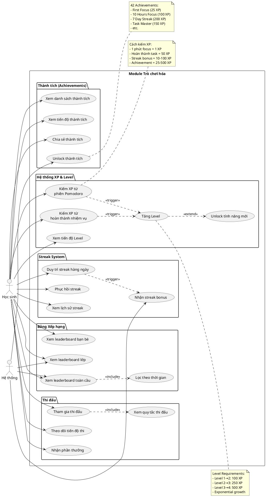
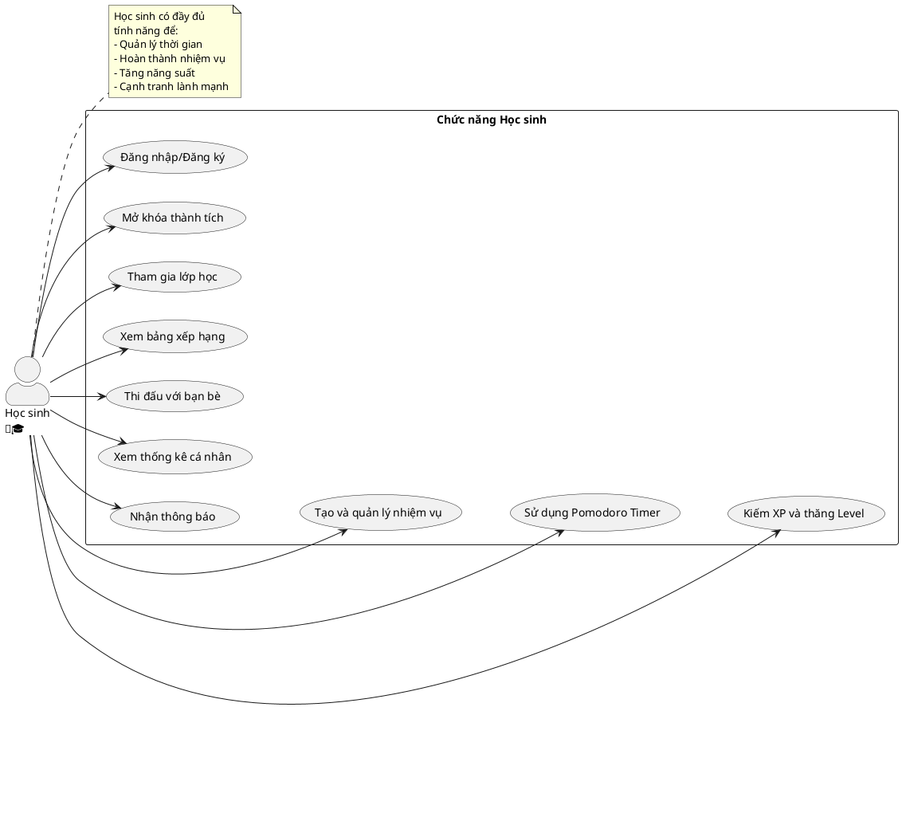
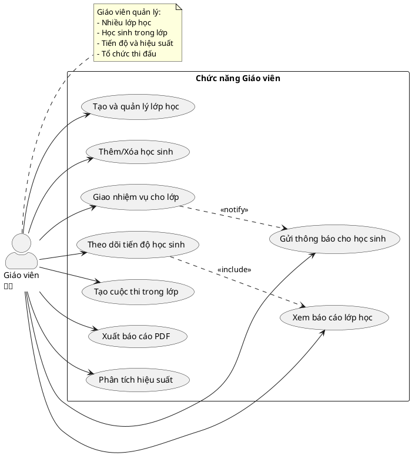

# Sơ đồ Use Case - DeepFocus Application

## Cách sử dụng:

### 1. Sử dụng PlantUML Online (Khuyến nghị)

- Truy cập: http://www.plantuml.com/plantuml/uml/
- Copy code PlantUML từ Phần 1
- Paste vào editor → Generate → Download PNG/SVG

### 2. Sử dụng Mermaid Live Editor

- Truy cập: https://mermaid.live/
- Copy code Mermaid từ Phần 2
- Paste → Export PNG/SVG/PDF

### 3. Sử dụng Draw.io

- Truy cập: https://app.diagrams.net/
- File → Import from → Text → Paste PlantUML code

---

## PHẦN 1: PlantUML CODE (Khuyến nghị cho Use Case)

### Use Case Diagram Tổng quan:

```plantuml
@startuml DeepFocus_UseCase_Overview
left to right direction
skinparam packageStyle rectangle

actor "Học sinh\n(Student)" as Student
actor "Giáo viên\n(Teacher)" as Teacher
actor "Phụ huynh\n(Guardian)" as Guardian
actor "Hệ thống" as System

rectangle "DeepFocus Application" {

  package "Xác thực & Quản lý Tài khoản" {
    usecase "Đăng ký" as UC1
    usecase "Đăng nhập" as UC2
    usecase "Đăng xuất" as UC3
    usecase "Cập nhật hồ sơ" as UC4
    usecase "Đổi mật khẩu" as UC5
  }

  package "Quản lý Nhiệm vụ" {
    usecase "Tạo nhiệm vụ" as UC6
    usecase "Chỉnh sửa nhiệm vụ" as UC7
    usecase "Xóa nhiệm vụ" as UC8
    usecase "Xem danh sách nhiệm vụ" as UC9
    usecase "Đánh dấu hoàn thành" as UC10
    usecase "Lọc nhiệm vụ theo trạng thái" as UC11
  }

  package "Pomodoro Timer" {
    usecase "Bắt đầu phiên Pomodoro" as UC12
    usecase "Tạm dừng/Tiếp tục" as UC13
    usecase "Kết thúc phiên sớm" as UC14
    usecase "Xem lịch sử phiên" as UC15
    usecase "Liên kết nhiệm vụ với phiên" as UC16
  }

  package "Trò chơi hóa" {
    usecase "Xem XP và Level" as UC17
    usecase "Xem thành tích đạt được" as UC18
    usecase "Xem bảng xếp hạng" as UC19
    usecase "Tham gia thi đấu" as UC20
  }

  package "Quản lý Lớp học" {
    usecase "Tạo lớp học" as UC21
    usecase "Thêm/Xóa học sinh" as UC22
    usecase "Giao nhiệm vụ cho lớp" as UC23
    usecase "Xem tiến độ học sinh" as UC24
    usecase "Tham gia lớp học" as UC25
    usecase "Tạo thi đấu trong lớp" as UC26
  }

  package "Thống kê & Báo cáo" {
    usecase "Xem dashboard cá nhân" as UC27
    usecase "Xem biểu đồ thời gian tập trung" as UC28
    usecase "Xem báo cáo hàng ngày" as UC29
    usecase "Xem báo cáo theo tuần/tháng" as UC30
    usecase "Xuất báo cáo PDF" as UC31
  }

  package "Giám sát Con em" {
    usecase "Xem hoạt động con em" as UC32
    usecase "Nhận thông báo cảnh báo" as UC33
    usecase "Gửi tin nhắn động viên" as UC34
    usecase "Xem báo cáo tiến độ" as UC35
  }

  package "Thông báo" {
    usecase "Nhận thông báo" as UC36
    usecase "Đánh dấu đã đọc" as UC37
    usecase "Xóa thông báo" as UC38
  }
}

' Student relationships
Student --> UC1
Student --> UC2
Student --> UC3
Student --> UC4
Student --> UC5
Student --> UC6
Student --> UC7
Student --> UC8
Student --> UC9
Student --> UC10
Student --> UC11
Student --> UC12
Student --> UC13
Student --> UC14
Student --> UC15
Student --> UC16
Student --> UC17
Student --> UC18
Student --> UC19
Student --> UC20
Student --> UC25
Student --> UC27
Student --> UC28
Student --> UC29
Student --> UC30
Student --> UC36
Student --> UC37
Student --> UC38

' Teacher relationships
Teacher --> UC1
Teacher --> UC2
Teacher --> UC3
Teacher --> UC4
Teacher --> UC5
Teacher --> UC21
Teacher --> UC22
Teacher --> UC23
Teacher --> UC24
Teacher --> UC26
Teacher --> UC27
Teacher --> UC30
Teacher --> UC31
Teacher --> UC36

' Guardian relationships
Guardian --> UC1
Guardian --> UC2
Guardian --> UC3
Guardian --> UC4
Guardian --> UC5
Guardian --> UC32
Guardian --> UC33
Guardian --> UC34
Guardian --> UC35
Guardian --> UC36

' System relationships
System --> UC36 : <<trigger>>
System --> UC18 : <<award>>

' Extensions and includes
UC12 ..> UC16 : <<include>>
UC23 ..> UC6 : <<extend>>
UC24 ..> UC30 : <<include>>
UC32 ..> UC35 : <<include>>

@enduml
```



---

### Use Case Diagram Chi tiết - Module Authentication:



---

### Use Case Diagram Chi tiết - Module Pomodoro Timer:



---

### Use Case Diagram Chi tiết - Module Class Management:



---

### Use Case Diagram Chi tiết - Module Gamification:



---

## PHẦN 2: MERMAID CODE (Cho GitHub/GitLab)

```mermaid
graph TB
    subgraph Actors
        Student[Học sinh]
        Teacher[Giáo viên]
        Guardian[Phụ huynh]
        System[Hệ thống]
    end

    subgraph Authentication[Xác thực & Tài khoản]
        UC1[Đăng ký]
        UC2[Đăng nhập]
        UC3[Đăng xuất]
        UC4[Cập nhật hồ sơ]
        UC5[Đổi mật khẩu]
    end

    subgraph TaskManagement[Quản lý Nhiệm vụ]
        UC6[Tạo nhiệm vụ]
        UC7[Chỉnh sửa nhiệm vụ]
        UC8[Xóa nhiệm vụ]
        UC9[Xem danh sách]
        UC10[Đánh dấu hoàn thành]
    end

    subgraph Pomodoro[Pomodoro Timer]
        UC12[Bắt đầu phiên]
        UC13[Tạm dừng/Tiếp tục]
        UC14[Kết thúc sớm]
        UC15[Xem lịch sử]
    end

    subgraph Gamification[Trò chơi hóa]
        UC17[Xem XP/Level]
        UC18[Xem thành tích]
        UC19[Bảng xếp hạng]
        UC20[Tham gia thi đấu]
    end

    subgraph ClassMgmt[Quản lý Lớp học]
        UC21[Tạo lớp học]
        UC22[Thêm/Xóa học sinh]
        UC23[Giao nhiệm vụ]
        UC24[Xem tiến độ]
        UC25[Tham gia lớp]
    end

    subgraph Statistics[Thống kê & Báo cáo]
        UC27[Dashboard cá nhân]
        UC28[Biểu đồ thời gian]
        UC29[Báo cáo hàng ngày]
        UC30[Báo cáo tuần/tháng]
    end

    subgraph Monitoring[Giám sát Con em]
        UC32[Xem hoạt động]
        UC33[Nhận cảnh báo]
        UC34[Gửi động viên]
        UC35[Xem báo cáo]
    end

    Student --> UC1 & UC2 & UC3 & UC4 & UC5
    Student --> UC6 & UC7 & UC8 & UC9 & UC10
    Student --> UC12 & UC13 & UC14 & UC15
    Student --> UC17 & UC18 & UC19 & UC20
    Student --> UC25 & UC27 & UC28 & UC29 & UC30

    Teacher --> UC1 & UC2 & UC3 & UC4 & UC5
    Teacher --> UC21 & UC22 & UC23 & UC24
    Teacher --> UC27 & UC30

    Guardian --> UC1 & UC2 & UC3 & UC4 & UC5
    Guardian --> UC32 & UC33 & UC34 & UC35

    System -.-> UC18
    System -.-> UC33
```



---

## PHẦN 3: Lệnh Command Line để tạo Use Case Diagram

### Sử dụng PlantUML CLI:

```bash
# 1. Cài đặt PlantUML
# Download từ: https://plantuml.com/download

# 2. Tạo file plantuml
# Copy code PlantUML từ Phần 1 vào file: usecase-overview.puml

# 3. Generate PNG
java -jar plantuml.jar usecase-overview.puml

# 4. Generate SVG (High quality)
java -jar plantuml.jar -tsvg usecase-overview.puml

# 5. Generate tất cả file .puml trong thư mục
java -jar plantuml.jar *.puml

# 6. Sử dụng Docker
docker run --rm -v $(pwd):/data plantuml/plantuml usecase-overview.puml

# 7. Generate với theme
java -jar plantuml.jar -theme bluegray usecase-overview.puml
```

### Sử dụng PlantUML với VS Code:

```bash
# 1. Cài extension PlantUML
code --install-extension jebbs.plantuml

# 2. Cài Graphviz (Required cho PlantUML)
# Windows (Chocolatey):
choco install graphviz

# macOS:
brew install graphviz

# Linux (Ubuntu):
sudo apt-get install graphviz

# 3. Trong VS Code:
# - Mở file .puml
# - Press Alt+D để preview
# - Right click → Export Current Diagram
```

### Sử dụng Mermaid CLI:

```bash
# 1. Cài đặt Mermaid CLI
npm install -g @mermaid-js/mermaid-cli

# 2. Tạo file mermaid
# Copy code Mermaid từ Phần 2 vào file: usecase.mmd

# 3. Generate PNG
mmdc -i usecase.mmd -o usecase.png -w 2400 -H 1800

# 4. Generate SVG
mmdc -i usecase.mmd -o usecase.svg

# 5. Generate với theme
mmdc -i usecase.mmd -o usecase.png -t forest
mmdc -i usecase.mmd -o usecase.png -t dark
mmdc -i usecase.mmd -o usecase.png -t neutral
```

---

## PHẦN 4: Công cụ Online (Không cần cài đặt)

### 1. PlantUML Online Server ⭐ (Khuyến nghị cho Use Case)

- **URL**: http://www.plantuml.com/plantuml/uml/
- **Cách dùng**:
  1. Copy code PlantUML từ Phần 1
  2. Paste vào text area
  3. Click "Submit"
  4. Download PNG/SVG

### 2. PlantText

- **URL**: https://www.planttext.com/
- **Features**: Online editor, real-time preview, export PNG/SVG

### 3. Mermaid Live Editor

- **URL**: https://mermaid.live/
- **Cách dùng**:
  1. Copy code Mermaid từ Phần 2
  2. Paste vào editor
  3. Export PNG/SVG/PDF

### 4. Draw.io / diagrams.net

- **URL**: https://app.diagrams.net/
- **Cách dùng**:
  1. File → Import from → PlantUML
  2. Paste code
  3. Edit và customize
  4. Export PNG/PDF/SVG

### 5. Visual Paradigm Online

- **URL**: https://online.visual-paradigm.com/diagrams/features/uml-tool/
- **Features**: Professional UML tool, many templates

---

## PHẦN 5: Script tự động tạo tất cả Use Case Diagrams

### PowerShell Script (Windows):

```powershell
# create-usecase-diagrams.ps1

# Tạo thư mục output
New-Item -ItemType Directory -Force -Path ".\diagrams\usecase"

# Tạo file PlantUML từ code
$files = @(
    "usecase-overview.puml",
    "usecase-authentication.puml",
    "usecase-pomodoro.puml",
    "usecase-class-management.puml",
    "usecase-gamification.puml"
)

# Download PlantUML jar nếu chưa có
if (-not (Test-Path "plantuml.jar")) {
    Write-Host "Downloading PlantUML..."
    Invoke-WebRequest -Uri "https://github.com/plantuml/plantuml/releases/download/v1.2023.13/plantuml-1.2023.13.jar" -OutFile "plantuml.jar"
}

# Generate diagrams
foreach ($file in $files) {
    if (Test-Path $file) {
        Write-Host "Generating $file..."

        # PNG
        java -jar plantuml.jar $file -o "..\diagrams\usecase"

        # SVG
        java -jar plantuml.jar -tsvg $file -o "..\diagrams\usecase"

        Write-Host "✓ Generated: $file"
    }
}

Write-Host "All diagrams generated successfully!"
Write-Host "Check folder: .\diagrams\usecase\"
```

### Bash Script (Linux/Mac):

```bash
#!/bin/bash
# create-usecase-diagrams.sh

# Tạo thư mục output
mkdir -p ./diagrams/usecase

# Download PlantUML jar nếu chưa có
if [ ! -f plantuml.jar ]; then
    echo "Downloading PlantUML..."
    curl -L https://github.com/plantuml/plantuml/releases/download/v1.2023.13/plantuml-1.2023.13.jar -o plantuml.jar
fi

# Generate diagrams
for file in *.puml; do
    if [ -f "$file" ]; then
        echo "Generating $file..."

        # PNG
        java -jar plantuml.jar "$file" -o ../diagrams/usecase

        # SVG
        java -jar plantuml.jar -tsvg "$file" -o ../diagrams/usecase

        echo "✓ Generated: $file"
    fi
done

echo "All diagrams generated successfully!"
echo "Check folder: ./diagrams/usecase/"
```

---

## PHẦN 6: Tùy chỉnh Themes & Styles

### PlantUML Custom Theme:

```plantuml
@startuml
' Custom colors and styles
skinparam backgroundColor #FEFEFE
skinparam handwritten false

skinparam actor {
    BackgroundColor<<Student>> lightblue
    BorderColor<<Student>> blue
    BackgroundColor<<Teacher>> lightgreen
    BorderColor<<Teacher>> green
    BackgroundColor<<Guardian>> lightyellow
    BorderColor<<Guardian>> orange
}

skinparam usecase {
    BackgroundColor lightcyan
    BorderColor darkblue
    BorderThickness 2
    FontSize 12
    FontStyle bold
}

skinparam package {
    BackgroundColor wheat
    BorderColor brown
    FontStyle bold
}

' Your use case diagram here
@enduml
```

### PlantUML với Material Theme:

```plantuml
@startuml
!theme materia-outline

' Your use case diagram here
@enduml
```

Available themes: `bluegray`, `plain`, `sketchy`, `materia`, `carbon-gray`, `reddress-darkblue`

---

## PHẦN 7: Templates chi tiết cho từng Actor

### Template cho Student Use Cases:



### Template cho Teacher Use Cases:



---

## PHẦN 8: Mô tả chi tiết Use Cases (Đặc tả)

### UC12: Bắt đầu phiên Pomodoro

**Tên**: Bắt đầu phiên Pomodoro  
**Actor**: Học sinh  
**Mô tả**: Học sinh bắt đầu một phiên học tập tập trung sử dụng kỹ thuật Pomodoro

**Tiền điều kiện**:

- Học sinh đã đăng nhập
- Không có phiên Pomodoro nào đang chạy

**Luồng sự kiện chính**:

1. Học sinh nhấn nút "Bắt đầu Focus"
2. Hệ thống hiển thị màn hình cấu hình
3. Học sinh chọn nhiệm vụ (optional)
4. Học sinh chọn thời gian (25/50/90 phút)
5. Học sinh xác nhận bắt đầu
6. Hệ thống bắt đầu đếm ngược
7. Hệ thống theo dõi focus score
8. Hệ thống phát hiện phân tâm (nếu có)
9. Hết thời gian, hệ thống thông báo hoàn thành
10. Hệ thống cộng XP và cập nhật streak

**Luồng thay thế**:

- 6a. Học sinh tạm dừng phiên → Use case UC13
- 8a. Học sinh kết thúc sớm → Use case UC14

**Hậu điều kiện**:

- Phiên Pomodoro được lưu vào lịch sử
- XP được cộng vào tài khoản
- Streak được cập nhật
- Nhiệm vụ được đánh dấu hoàn thành (nếu có)

---

## Ghi chú:

**Khuyến nghị công cụ cho Use Case Diagram:**

1. **PlantUML Online** ⭐⭐⭐⭐⭐ - Tốt nhất

   - Syntax đơn giản
   - Kết quả chuyên nghiệp
   - Export quality cao

2. **Visual Paradigm Online** ⭐⭐⭐⭐ - Chuyên nghiệp

   - Giao diện kéo thả
   - Nhiều template
   - Phù hợp báo cáo

3. **Mermaid** ⭐⭐⭐ - Đơn giản
   - Tốt cho GitHub/GitLab
   - Cú pháp ngắn gọn
   - Hạn chế về styling

**Lời khuyên:**

- Sử dụng **PlantUML** cho báo cáo học thuật
- Chia nhỏ thành nhiều diagram thay vì 1 diagram lớn
- Sử dụng colors để phân biệt actors
- Thêm notes để giải thích

Chúc bạn tạo Use Case Diagram thành công! 🎯
